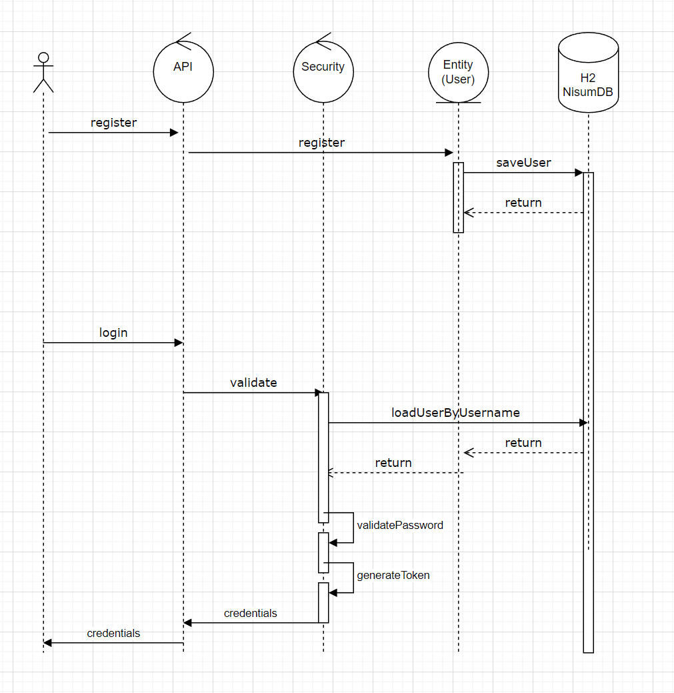

# nisum-challenge
Nisum Challenge

Instalación
- git clone https://github.com/raulespinola/nisum-challenge.git
- mvn clean
- mvn install

Api
- Swagger: http://localhost:8080/swagger-ui/#
- Registrar Usuario:  localhost:8080/register
  - {
    "email": "string@gma.com",
    "username": "string",
    "password": "strinG*123",
    "phones": [
    {
    "cityCode": "string",
    "countryCode": "string",
    "number": "string"
    }
    ]
    }
- Login Usuario: localhost:8080/login
  - {
    "username":"string",
    "password":"strinG*123"
    }

- En el Proyecto se proveen las Postman Collection para pruebas

Diseño Secuencial de Interaccion

